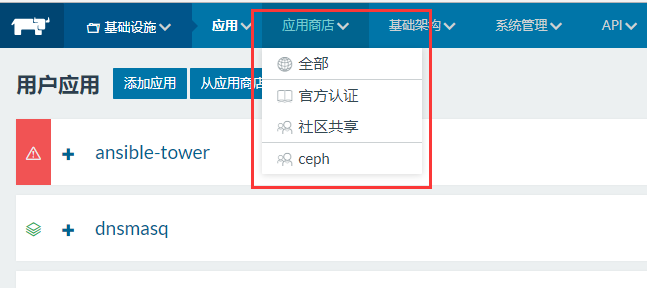

# 基于rancher的docker集群

[rancher官网](https://rancher.com/)

[rancher1.X版的中文文档](https://rancher.com/docs/rancher/v1.6/zh/)

## rancher简单说明

rancher官方将自己叫做`全栈化容器管理平台`，除了其自研的`cattle`引擎外，也支持对`kubernetes` `mesos` 
`docker swarm`等容器集群的托管。

### 展示并使用rancher并部署服务

具体ui操作参考[在Rancher中部署服务](misc/在Rancher中部署服务.md)，下面只演示下要点

一些功能要点：

- 使用rancher自带的负载均衡器暴露端口
- 在大规模的集群中，可以使用traefik来进行7层负载均衡，并管理路由
- 可以通过rancher nfs来进行volume的挂载
- 服务间可以通过dns进行通信，同一stack下可以使用`{service name}`，
stack间使用`{service name}.{stack name}`比如访问zookeeper通过`zk.zookeeper`

#### 1. 演示部署一个gitea

gitea需要一gitea服务，一个mysql数据库，并且两个服务的数据需要挂载到nfs上。完成后，gitea的端口需要
暴露出来。

#### 2. 演示部署一个nextcloud

基本相同

#### 3. 使用rancher的商店功能来快速部署

rancher集成了一个商店的服务，除有许多基础设施（dns，网络集群，存储等）服务外，还有许多社区贡献的，
可以用于快速部署的模板。

- 演示一下zk的部署
- 给大家看下有些什么

## kubernetes(k8s)简介

[Kubernetes系统架构简介](http://www.infoq.com/cn/articles/Kubernetes-system-architecture-introduction)

k8s可以看做google内部容器管理技术的开源版。从去年开始基本已经奠定了其容器管理一哥的地位。不管从
功能、性能、还有生态上，其他的管理平台都没法和其相比，但依旧有一些问题：

- k8s的架构非常复杂，部署维护难度非常高，再加上其相关的许多镜像、安装包都部署在google的服务器上，
国内无法直接下载，更加大了运维难度

- k8s有dashboard，但功能很少，部署服务还是必须依赖yaml定义的文件，所以如果不对k8s很了解，基本无法
进行操作。这点rancher的ui非常简单，及时不懂docker，简单培训下也可以开放给一般开发人员使用。

## 基于k8s的rancher2.0

rancher从2.0开始，已经完全替换了底层，使用k8s来进行集群的管控。在`https://192.168.58.197/`上，部署了
一个rancher2.0的demo，可以演示下功能。

虽然2.0已经正式发布，但2.0的官方文档与解决方案还不完整，从1.X的迁移方案也还没给出，短期内是不会迁移
到2.0上。但k8s已经是事实的容器管理标准，而且官方也说过1.X版本只会再维护一年，所以后面肯定会做迁移。

