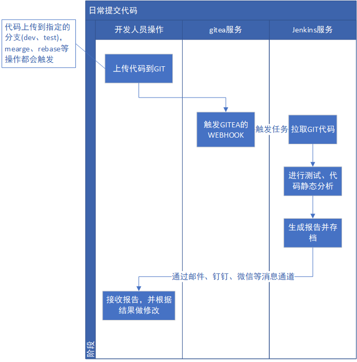
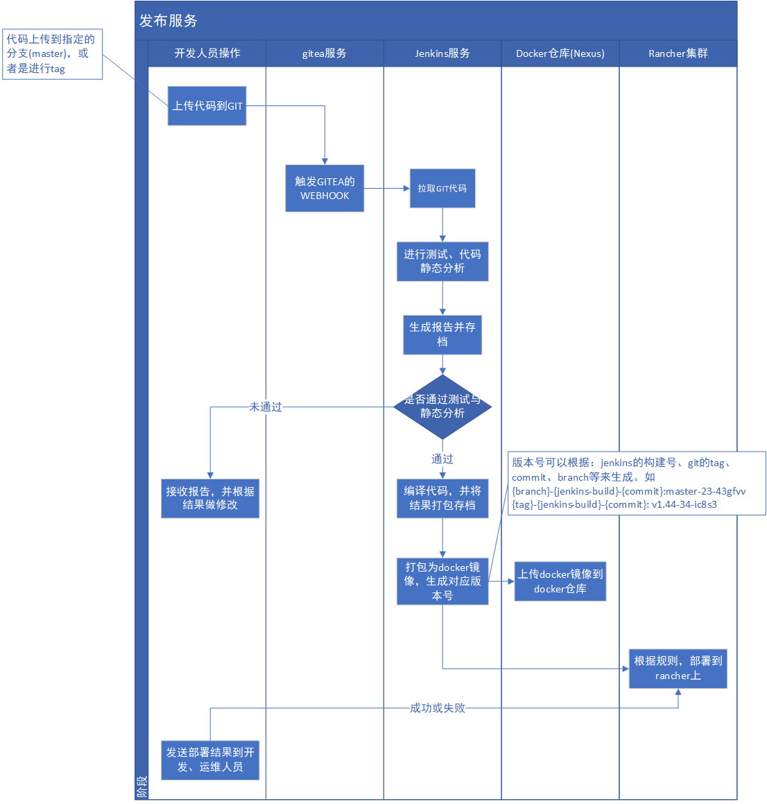
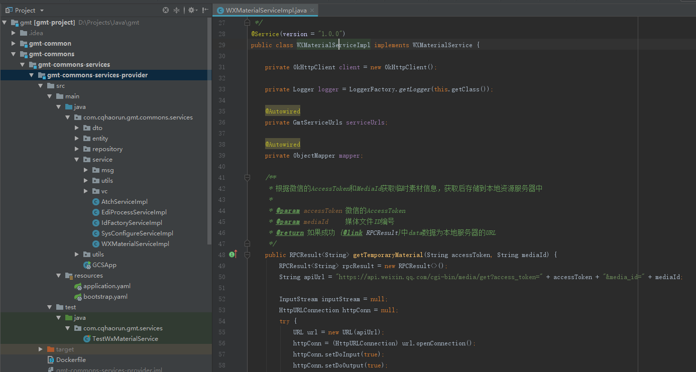
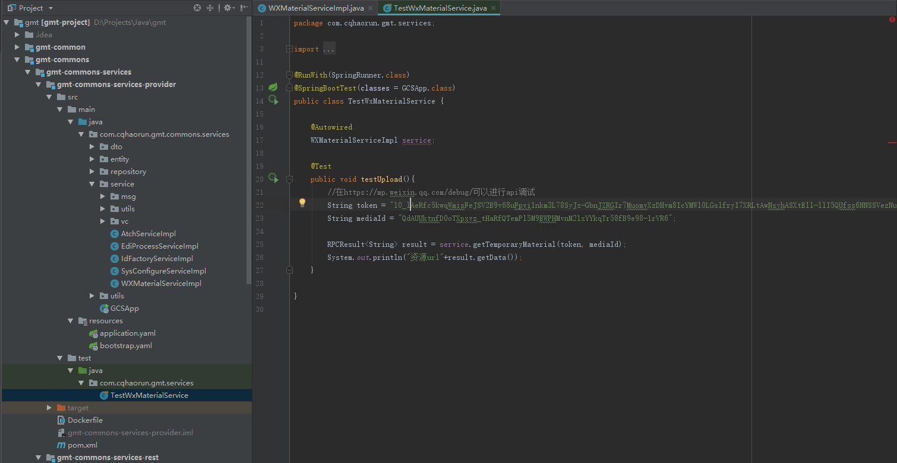

# 持续集成(CI)与持续部署(CD)

- CI是个什么流程？
- 一些测试的工具方法
- GIT开发流

当软件很简单的时候，搭建一个服务只需要一个服务器，然后结构可能是这样的：

```
服务 -> 数据库
```

当业务扩展服务会变多

```
服务1 ->
服务2 -> 数据库
服务3 ->
```

使用的域名，还有路由规则也变得复杂，需要使用反向代理:

```
         服务1 ->
nginx -> 服务2 -> 数据库
         服务3 ->
```

当业务规模慢慢扩大，主机、服务的数量都在扩大，为了保证可用性，各个环节都不能使用单点，
而且还需要其它各种中间件服务来支持业务：

```
         |                    |
         |   |服务1|   ....   |
nginx -> |   |服务2|          | <->  | 数据库1 |       
nginx -> |   |服务3|          | <->  | 数据库2 |
nginx -> |    主机1           | <->  | 数据库3 |
         |                    |     
         |   |服务3|   ....   | <-> | MQ |
         |   |服务4|          | 
         |   |服务5|          | <-> | Redis |
         |    主机2           | 
         |                    | <-> | 各种中间件、基础设施...| 
```

随着业务规模的扩大，开发、测试、生产环境之间的差别，架构的复杂度的增加，服务的增多都会使测试和
发布部署变得越来越复杂。

>持续集成的目的，就是让产品可以快速迭代，特别业务、代码、架构都越来越复杂的情况下。同时还通过自动化
的测试，保证软件质量。

## 一个理想的CI流程应该是怎样的？

对一个理想的流程，应该在提交代码后，能够自动完成测试、分析、部署等操作，最大程度减少开发、运维
人员的操作，并能及时将结果报告给开发、运维人员。

日常提交代码，可以自动对代码进行测试与分析



对特定分支进行提交或者tag后，可以自动部署对应的代码



>可以看到即使流程很复杂，涉及的系统也很多，但开发人员都只需要上传代码，再等ci系统回执报告就可以了。

### 一个简单的nginx配置更新流程

使用gitea的webhook，结合[webhook](https://github.com/adnanh/webhook)服务，通过触发ansible-play book
来实现nginx集群配置的自动更新。

还使用了[acme.sh](https://github.com/Neilpang/acme.sh)这个工具来实现了证书的自动签发与更新。

> 提交新的nginx配置 -> 触发gitea webhook -> 触发ansible主机上的webhook服务 -> 
webhook服务调用 ansible-playbook来拉取并更新nginx集群 -> 将更新结果回执运维人员

这里通过现场演示让大家感受下一个完整的自动化流程可以在多大程度上减少操作

## 理想与现实的差距……

- 没有人在编写测试，不管是单元测试，集成测试。导致如果将流程自动化了，部署的代码将无法保证质量。
- 代码的静态分析工具需要选型，并部署或编写规则
- gitea的webhook触发jenkins任务的流程需要自己编写服务，来解析webhook的内容，这里还没开工
- 要将服务自动发布到rancher上，需要定义好`版本号规则`，`服务命名规则`等，来方便进行自动化的部署。
这里需要在研究并总结下日常开发的流程与实际需求

## 一些测试的方法与工具

测试是分很多种的，单元测试、冒烟测试等……。由于系统模块、服务多，还可能需要对各个层级进行测试。
但这样太复杂，写测试的时间可能比写代码还要多……当前不现实，所以建议至少做到下面几点：

- 针对非简单增删改查的业务，特别是基础的、涉及业务框架的，要编写一些单元测试来保证稳定。
（同时通过预先进行单元测试，也可以避免部署后才能测试的囧况，实际能节约时间）
- 特别针对前端，各种业务流程，可以使用一些自动化测试工具来`录制`,`编写`测试

### 一个用单元测试来测试微信的功能的例子

在`gmt\gmt-commons\gmt-commons-services\gmt-commons-services-provider`中，有一个通过微信mediaid来获取
微信上传资源并，并保存到我们服务器上的dubbo服务



以前测试就是部署后，再调用，尝试能否成功，但如果有bug这样调试太过复杂，完全可以通过一个一次性的单元测试
来进行测试



及时以后这个dubbo服务被修改，需要回归测试，也只需要修改测试代码中的token和mediaId就可以。

>但现在的代码也还是`一次性`的，并不能保证每次都成功运行。如果要写完整，还需要加上一个完整的流程才能保证
测试的完整。

```java
//理想的完整测试流程，实际上并没有getToken()或者uploadImg()方法，所以根本不可能完成自动化的测试
//获取微信token-> 上传一个测试图片 -> 获取测试图片的mediaId -> 通过mediaId获取图片
String token = someService.getToken()
String mediaId = someService.uploadImg()

RPCResult<String> result = service.getTemporaryMaterial(token, mediaId);
System.out.println("资源url"+result.getData());
```

>所以实际上不只是测试要完整，而且业务功能也开发时也必须考虑测试需求，不能只想到完成功能。

### 前端的自动化测试

先说好……我其实也不太懂这块……只是了解并试过一些工具。

并且大部分工具都可能通过实际的操作与录入来`录制`测试脚本，并生成对应代码，如果掌握了是可以
大幅简化复杂的业务流程的测试的。

#### Katalon Recorder来进行录制

可以参考下这篇文章https://juejin.im/post/5b25e8cae51d4558c4720845

使用了火狐的Katalon Recorder，来对操作进行录制，可以直接在浏览器上回放，
也可以生成java、python等多端的代码。


#### macaca + uirecoder

https://macacajs.github.io/zh/introduction

Macaca 是一个多端的测试解决方案，可以测试web、android、ios等。提示下测试android搭建环境比较痛苦，
ios也只可能在mac上测试，所以官方的demo除非你是mac不然就不要试了。

这里只试验下前端的测试,使用uirecoder录制测试。

https://github.com/alibaba/uirecorder

```bash
#安装uirecoder
npm install uirecorder mocha -g
#初始化测试项目
uirecorder init
#录制脚本
uirecorder sample/test.spec.js
```

运行脚本

```
#启动webdriver server
npm run server
#执行所有测试
npm run paralleltest
```

## GIT开发流

虽然有了prod-test-dev的分支，但当前在代码分支管理上还是太简单。这里简单介绍下比较流行的git flow开发流。

首先要认识到，分支管理不是技术问题，而是管理的问题，只是git的分支管理比较好、比较方便，只是使用git并不能
解决开发流程混乱、代码混乱的问题。

同样git flow也只是一种开发流程，虽然有相应的插件来方便使用，但并不一定就适合当前的开发模式，如果管理者
和开发者对代码的管理有清楚的认识，不使用git flow，自己定义好一套管理规范也没问题，甚至可能才是最好的选择。

### 当前开发流程是怎样？git flow是怎样？