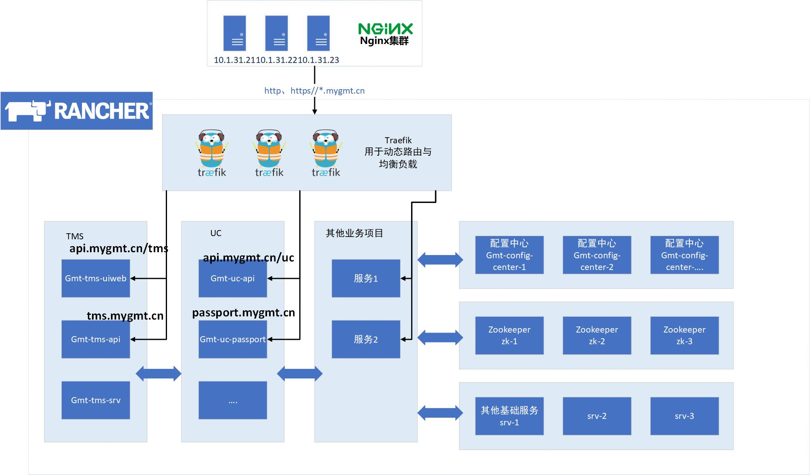
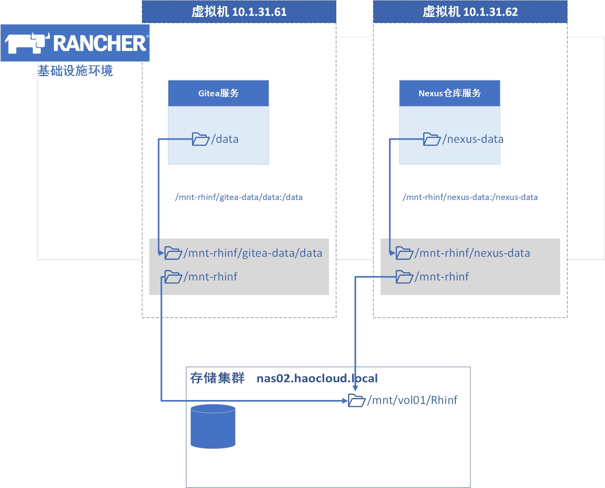
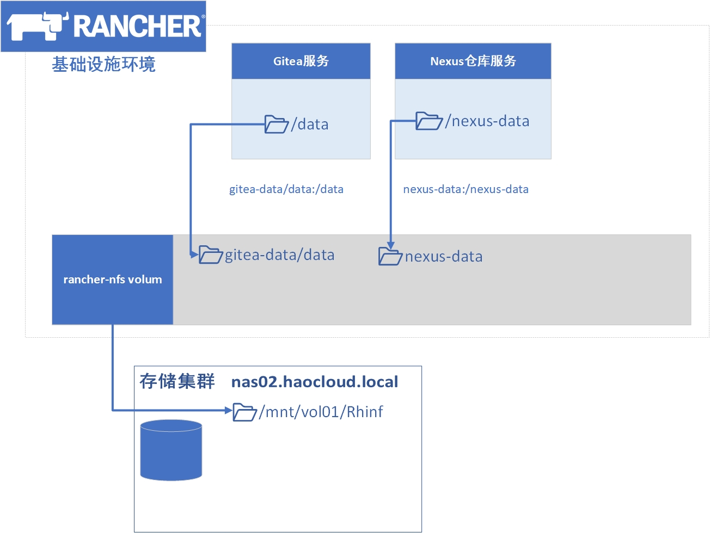
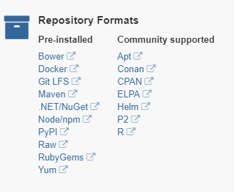

# 当前架构与一些工具的简介

这里介绍一下围业务服务部署的环境（主要是rancher）的部分架构，主要是从http 请求到服务响应的整个过程。

然后还介绍一些当前运维用到的一些工具，也许可以开拓大家的眼界。部分工具也是完全可以用到开发中，或者
去支撑一些业务服务。

## 架构的简单说明

### http请求现在是怎么到达服务的？

比如一个`GET http://tms.mygmt.cn`的请求经过了那些处理？

1. 在请求过了防火墙、和nginx前的lvs4层负载均衡后，请求到达了nginx集群。nginx现在一律将
规则为`*.mygmt.cn`的域名交给后面rancher中的traefik集群。

2. traefik会不断监听rancher服务中的服务原信息，根据docker label中的traefik配置，来动态事实的生成
路由信息。这里当`GET http://tms.mygmt.cn`到达后，就会找到规则为`traefik.frontend.rule=Host:tms.haorun.win`
的服务，将请求交给它。

3. 服务处理完请求后，将响应原路返回

### 为什么搞这么复杂，要两级7层负载

首先除了业务服务外，还有很多服务现在是没办法容器化的，是单独部署到虚拟机上的。另外nginx虽然配置
比较复杂，但功能要比traefik多很多（但性能两者差距不大，nginx基本只比traefik快30%左右）。

而使用traefik来做业务的负载与路由，主要是考虑服务变多后，如果全部都用nginx来做，nginx的配置会
非常复杂。实际上，在迁移服务前，所有服务都在单个主机的时候，nginx的配置就已经复杂，而且配置中
只有端口号可以和服务对应，很难维护和对应服务的时间情况。

而traefik的配置是直接和服务写在一起，在其对应容器的docker label中，配置简单明了，甚至在开发人员
简单学习后可以自己配置路由信息。并且由于其是根据服务的真实情况来动态生成路由，在服务宕机时相当
于有了简单的熔断保护。

### traefik是啥？

https://traefik.io/

traefik是个使用go编写的http反向代理（7层负载均衡器），主要就是针对的微服务场景，能够轻松和docker
、swarm、k8s等集成，也支持向zookeeper、etcd、consul作为配置后端，从而能够自动、动态的对http的路由
与负载均衡进行配置。

和nginx对比，traefik主要是大幅降低了配置难道，而且自动、动态的配置也减轻了运维压力，提升了可用性。

### 容器中数据的持久化

现在有3个rancher集群，分别是：
- 基础设施 inf ，用于部署支持开发和公司的一些基础服务（git、nexus等）
- 测试环境 test，业务的测试环境
- 生产环境 prod，业务的生产环境

三个环境都有服务需要写入，并持久化文件的需求。每个环境都是通过nfs来挂载远程磁盘目录来实现的。其原理
与docker的volume基本一样，不过现在有两种实现，效果基本是一样的：

- 在宿主机的目录上挂载存储服务暴露的nfs目录，再用docker挂载宿主机的目录，所有主机的挂载使用ansible来
配置，从而保证一致

- rancher有nfs插件，通过插件来挂载nfs目录，容器再使用rancher-nfs volum来挂载nfs

### zookeeper在哪里？

现在在每个环境（test、prod）中，都通过rancher，单独部署了zookeeper集群，并且都只能在集群内部
访问，没有对外部暴露。在内部访问时，则是通过rancher的dns功能，通过`zk.zookeeper:2181`来访问的。
由于zk自身就支持dns服务发现，所以通过域名就可以自动获取到所有的zk节点

### spring-cloud-config-server + git 用作服务的配置中心

代码放在了https://git.cqhaorun.com/Hao/Hao-Cloud.git

官方的文档可以参考 
- https://cloud.spring.io/spring-cloud-config/
- https://springcloud.cc/spring-cloud-config.html

使用说明在以前写过详细文档，[点击这里](misc/配置中心说明.md)可以查看

同时要注意spring cloud的组件，当前只使用了spring cloud config，其他的暂时全都没用。

还需要另外说明的是现在的配置是通过公网的`https://config.cloud.hrtest.win/`域名进行拉取的，
及时使用了https和basic auth验证依旧不安全，但当时由于工期紧张这里没有再做修改。

后面会对config-server添加多用户的权限验证，敏感信息和测试信息的权限会做区分，而访问也会放在
内网。

### 扫描项目自动生成配置文件

基于gradle与kotlin写了个扫描gmt项目，来自动生成dockerfile与spring配置的工具

https://git.cqhaorun.com/gmt/gmt-meta-scan

这里简单介绍下：
- 项目的结构与使用
- gradle的一些使用，kotlin的一些语法

### minio对象存储

文档参考 https://www.minio.io/

官方其实也有中文文档，不过有小部分不全 https://github.com/minio/minio/tree/master/docs/zh_CN

其实和以前写的gmt-rc功能差不多，不过minio的生态、功能都要强大很多。自带多个语言的sdk，兼容
aws s3的api。也写了个`gmt-commons/gmt-minio-starter`用于快速配置。现在主要就是gmt-mall的项目在用，
还有平时用来暴露些临时的资源到公网也很方便。

### kafka 

官方对kafka的定义其实是流数据处理平台，当然大部分时候大家也只用得到它的mq（消息队列功能）。
在功能、性能上，kafka基本也是mq里面的一哥。虽然部署维护较其他mq要来得复杂，但因为用的rancher
商店来部署的，其实部署上是非常简单的，可以随时做部署。

rancher中部署kafka其实很简单，所以有一个测试的集群`10.1.31.[61-63]:9092`可以用于测试。
同时在`http://10.1.33.12:9000/`上有个`kafka-manager`可以对kafka做管理

## 运维周边的服务与工具

### gitea git服务

公司的gitea地址 https://git.cqhaorun.com/

开源、自建的git服务基本只有两个选择，gitlab和gogs。而gogs由于常年由作者一个人维护，而且对社区提交的
代码非常苛刻，还有神隐一年没有更新的黑历史，所以社区fork了gogs，有了gitea。总的来说gogs和gitea除了
维护方式，功能上差距不大。

对比gitlab，gitea其实在功能上要差不少，一方面gitlab自带一个ci系统，功能还可以。另一方面gitlab做
得久生态上好一些。gitlab还有企业版与云服务，功能更完整，不过就要给钱了。

但gitlab缺点主要就是由于是用的ruby，性能浪费严重，4核8g内存的机器可能勉强不卡，而且也就能支持10
来人的小团队。gitea是用go写的，甚至能跑在树莓派上……

公司选的gitea，主要还是因为gitea自带中文，维护部署简单，而且功能虽然差点其实也不弱了。至于ci，有
jenkins，gitlab自带那个就不需要了。

### nexue 用作maven、docker仓库，还支持多种服务

官方网站 https://www.sonatype.com/nexus-repository-sonatype
公司私人仓库地址 https://mvn.cqhaorun.com

单纯对于私人maven仓库，nexus基本上已经是做得最好的。同时nexus还能用一个服务支持docker、npm、
.NET/NuGet、yum等很多仓库类型。权限管理、仓库代理等功能也很齐全，所以本来也是最好的选择。

这里演示下基本的功能:
- 上传项目到仓库，分两种，1本地通过maven deploy，2网页上直接上传jar包。当然推荐使用第一个
- 通过web界面搜索，查询仓库中的项目（maven和docker镜像）

### jenkins ci系统

jenkins已经是很老牌的ci系统了，虽然现在做ci的多了，但现在依旧是功能最强的
（同时也是最复杂的……）。

基本功能平时都在用，就不多说了。特别说明的是，现在jenkins的server和编译服务器其实是有些不同的。
jenkins server跑在rancher集群中，而编译其实是用的jenkins-agent功能，在
`10.1.31.[61-63]`三个基础设施的服务器上进行的构建。

### seafile 网盘

公司网盘地址 https://pan.cqhaorun.com/

seafile是个私人网盘服务，现在其实最主要的功能是管理发布的apk包。其他的基本好像没人在用……

对比nextcloud、owncloud，sefile的架构复杂、性能优异，功能要稍强一些。不过ui绝对是最丑的。

现在大家都有docker部署的方案，所以其实部署难度都差不多，有兴趣自己搭个网盘也很简单的。

### ansible 

ansible是个主机配置管理的工具，现在比如promthus的主机探针，nginx的证书和配置，各个主机的nfs
目录挂载都是用ansible来完成的。

做主机配置管理的工具其实不少，Puppet、Chef、Ansible和SaltStack是四大金刚。但是ansible对主机
入侵最少，能ssh上去就可以，不想其他的要预埋agent，很麻烦。

这里演示下：
- ansible的仓库和脚本
- 直接用命令测试 `ansible all-hosts -m ping`
- 用ansible playbook来配置下nginx的配置

### elk efk来做日志收集

elk是elasticsearch + logstash + kibana ，efk是日志收集 elasticsearch + filebeat + kibana。
两个其实都是用elastic来做日志分析，kibana做可视化。

logstash侧重于服务将日志推送给logstash，然后logstash解析，处理后发送给elastic来存储，分析。

filebeat则是收集、分析主机上的日志文件，然后通过elastic的模板让elastic自己解析后存储分析。

在日志收集上，elastic给出了包括nginx、mysql、kafka等许多系统的日志分析方案，不需要自己去写
解析规则。

elasticsearch的本职其实是搜索引擎（全文索引），所以有完整的分词（包括中文）等功能。同时由于
分析数据的能力很强，又有了用于监控、数据分析等很多其他场景。

kibana是elastic官方的可视化工具，具体能做什么后面直接看就是……

>如果要收集业务系统的日志，首先请大家打印日志都用logger，
打印有用的信息并分好层次（debug、info、warn、error），并统一格式

这里演示下：
- 通过kibana查看收集的日志，并通过各种条件来检索
- 在kibana中创建图表、和面板（dashboard）
- 在预设的nginx dashboard中来分析下网站的整体访问情况

### 监控系统prometheus  -> grafana

prometheus是容器兴起后，新一代的监控系统，本质上其实是一个时序数据库（tsdb-Time series database）

prometheus不仅能监控主机，由于其比较特殊的设计和完善的生态，还能监控许多软件、系统和设备。具体
可以参考 https://prometheus.io/docs/instrumenting/exporters/。并且比较特殊的是像k8s还有ectd这些
系统，内部会暴露系统指标的端口给promethus，而并不需要单独为其埋设探针，并且这样的系统应该还会
越来越多。

grafana也是一个可视化工具，主要针对的是各种监控的场景。最主要的使用场景也是和prometheus一起，
实时分析其数据。同时grafana也支持多种数据源（prometheus、influxdb、mysql、opentsdb等……）

这里演示下:
- prom的配置是怎样？默认拉取而不是推送的设计
- 随便找一个node，来看下指标有哪些
- 在grafana上查看数据、定义表格与报警规则
- grafana的商店，从中导入表格数据
- grafana的多数据源功能，来对mysql等的数据做可视化

### zepplin做可视化

中文文档 http://cwiki.apachecn.org/pages/viewpage.action?pageId=10030571

zepplin是个大数据分析的工具，主要是结合spark来做分析。不过其支持的源也很丰富，从mysql去取数据
也没什么问题。

实际上没有使用，只是试了下，不过功能挺强，简单的功能可以直接用iframe导出然后嵌入业务

现在部署了一个 http://10.1.31.63:23480，可以测试。官方有很完整的docker方案，自己部署也很简单。

- 演示下官方的demo

## 还缺什么？

- 自定义的dns服务，部分服务就不开放到公网了
- 配置中心完善权限功能，限制公网访问。（写好了，没测，怎么重构整体的配置文件没想好）
