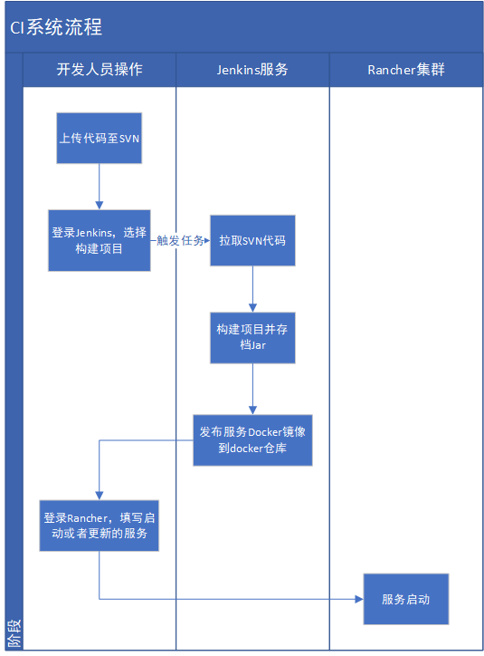
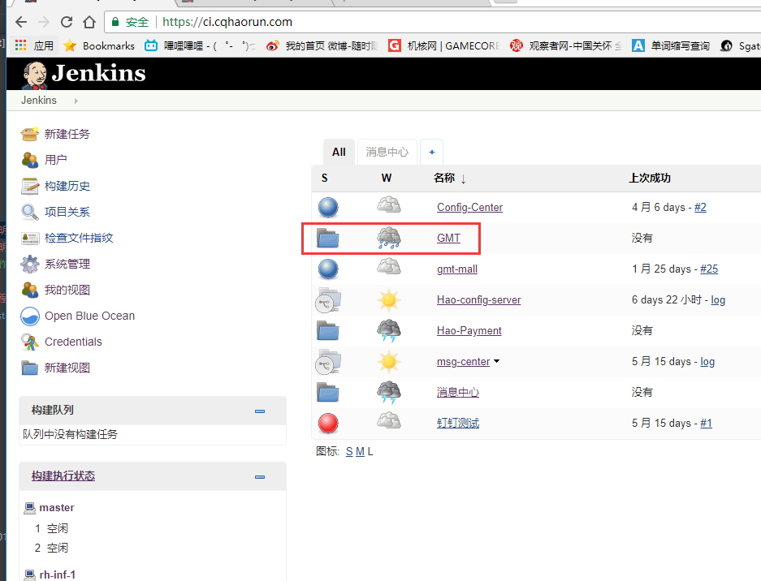
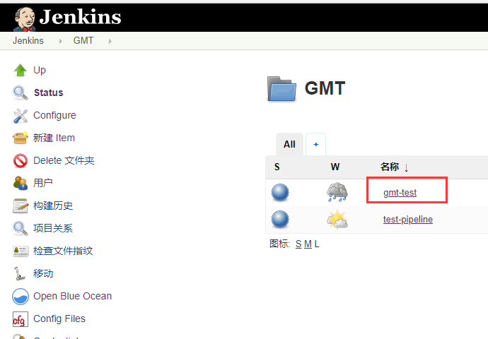
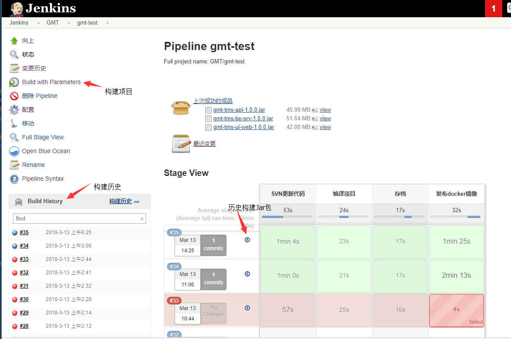
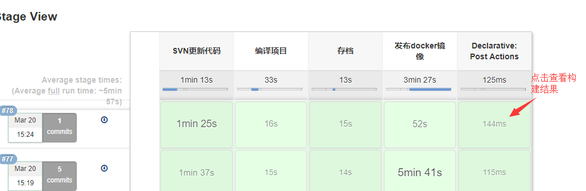
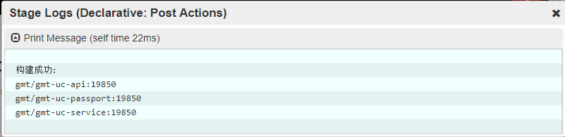

# CI系统操作使用说明

ci,是持续集成，就是让产品可以快速迭代，同时还能保持高质量。它的核心措施是，
代码集成到主干之前，必须通过自动化测试。只要有一个测试用例失败，就不能集成。

由于现在并没有自动化的测试用例，也没有分支管理，所以ci系统只做基本的服务构建与发布。

- CI系统选用的[Jenkins](https://jenkins.io/)
- 地址是https://ci.cqhaorun.com/
- 本文档只适用于gmt项目的构建

基本整个发布，构建的流程如下图：

## 1.选择构建应用

登录后，选择需要构建的应用，现在只有`gmt/gmt-test`

## 2.进行构建

进入项目页面，选择`Build with Parameters`进行构建。其中填写的参数`PACKAING_MODEL`，定义在
`gmt`项目中的`packaing-models.yaml`文件中，用于说明需要构建的项目。

例如输入`gmt-uc`，jenkins会扫描`packaing-models.yaml`中的`gmt-uc`项，构建`gmt-uc/gmt-uc-api`,
`gmt-uc/gmt-uc-passport`,`gmt-uc/gmt-uc-service`三个项目。

完成后，查看日志，可以看到构建的结果，每一行就是构建的`docker镜像名`，镜像的后缀版本号使用的是
svn的`reversion`。

## 3.发布，部署服务

请参考`在Rancher中部署服务`这一文档