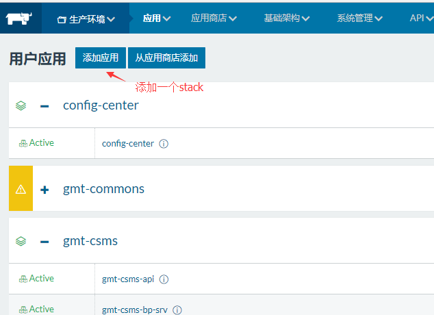
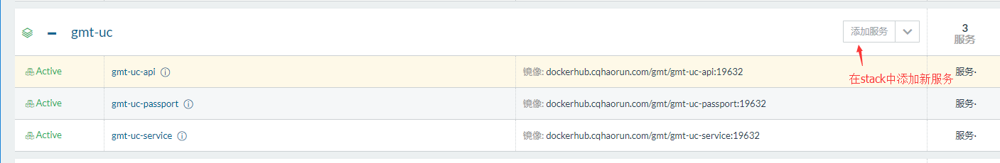
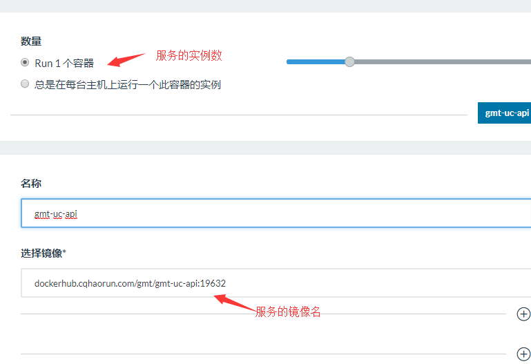
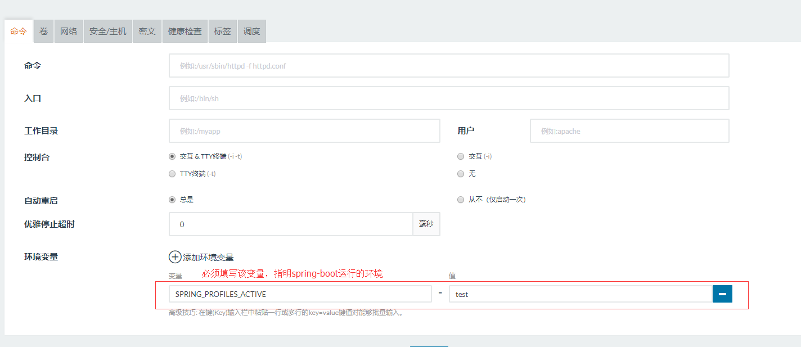
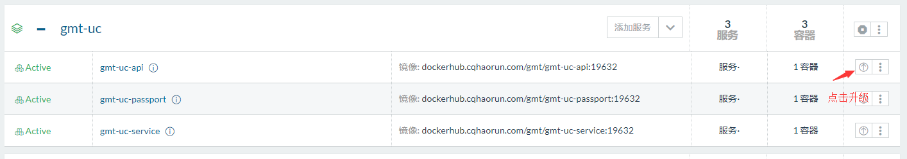
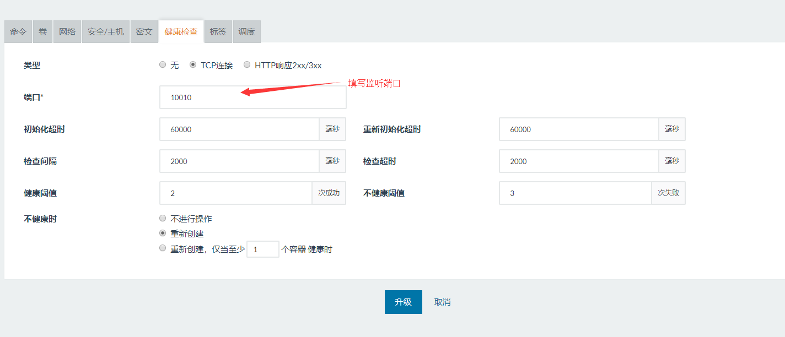
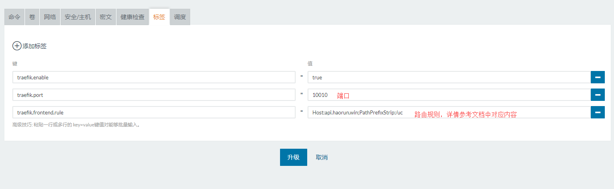
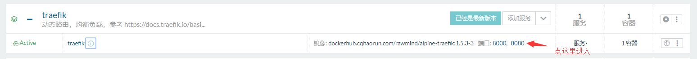
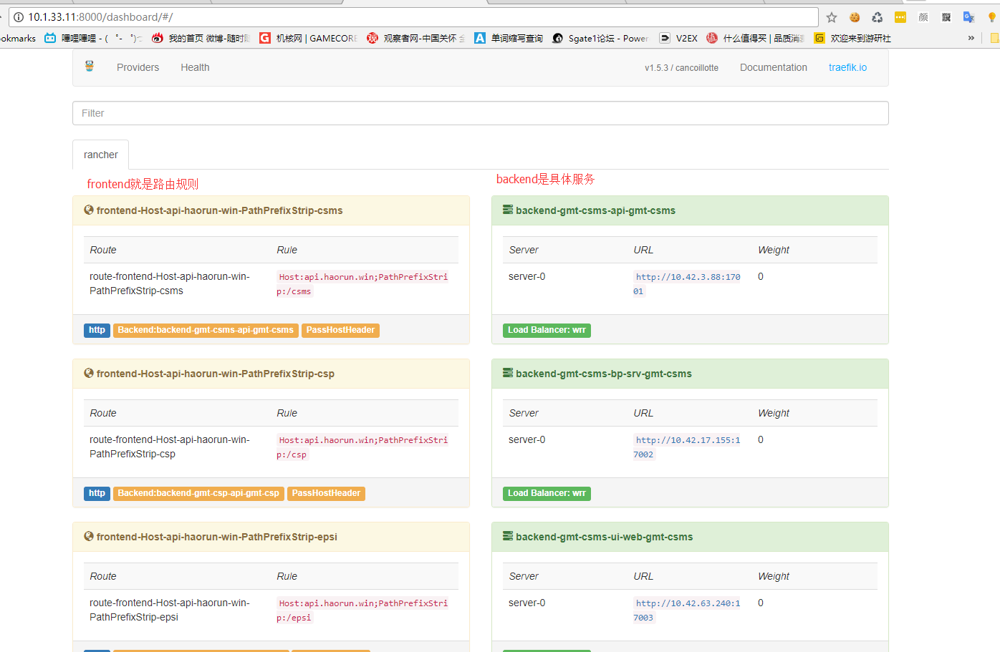

# 在Rancher中部署服务

[rancher]是一个容器管理平台，其具体功能请参考其[官方文档](2.rancher文档)。本文只介绍如何结合公司的ci
系统，将GMT相关应用打包、部署并发布到制定的域名与路径下。

## 1.登陆

[rancher](2.rancher文档)集群的访问地址是https://rh.hrtest.win，账号密码请找管理员要一个


## 2.部署

如果是一个新项目，首先需要建立一个stack，点击左上的添加应用，并输入项目名



比如建立了一个`gmt-uc`的stack，点击添加服务就可以进行添加



在服务中填写对应的服务名，服务的镜像名（在CI系统中打包而来），然后**必须**填写
`SPRING_PROFILES_ACTIVE=[dev,test,prod]`环境变量，来指明应用的环境，让服务能从配置中心拉取配置。





## 3.使用traefik动态路由，均衡负载配置域名与路径

例如，如果要配置 `api.haorun.win/uc`映射到`gmt-uc-api`的`10010`端口

在服务中为`gmt-uc-api`服务添加**健康检查**，然后添加如下标签:

```
traefik.enable=true
traefik.port=10010
traefik.frontend.rule=Host:api.haorun.win;PathPrefixStrip:/uc
```

升级服务后，traefik会自动发现服务并将`api.haorun.win/uc`的请求路由到`gmt-uc-api:10010`上

### 3.1 配置健康检查

首先必须配置服务的健康检查，点击升级服务



在项目中点击健康检查，默认使用tcp检查，并填写对应端口。其他配置使用默认即可。



### 3.2 在服务中配置路由规则

再点击标签项，配置路由规则。这里只需要使用三个标签。
其中`traefik.frontend.rule`是路由具体规则,详细规则可以参考[traefik文档](1.traefik配置规则)，
多个规则用`;`隔开。

```
traefik.enable=true
traefik.port=10010
traefik.frontend.rule=Host:api.haorun.win;PathPrefixStrip:/uc
```



### 3.3 在traefik dashboard中查看配置情况

登陆vpn后，可以直接访问traefik面板，查看路由规则与服务状态



面板中左边是路由规则，右边就是具体服务，可以在这里排查些问题



### 3.4 可参考的文章

- [traefik路由规则说明](1.traefik配置规则)
- [rancher-trafik规则说明](https://github.com/rawmind0/rancher-traefik)
- [Rancher部署Traefik实现微服务的快速发现](https://www.cnrancher.com/rancher-traefik/)


[1.traefik配置规则]: https://docs.traefik.io/basics/#matchers
[2.rancher文档]: http://rancher.com/docs/rancher/v1.6/zh/